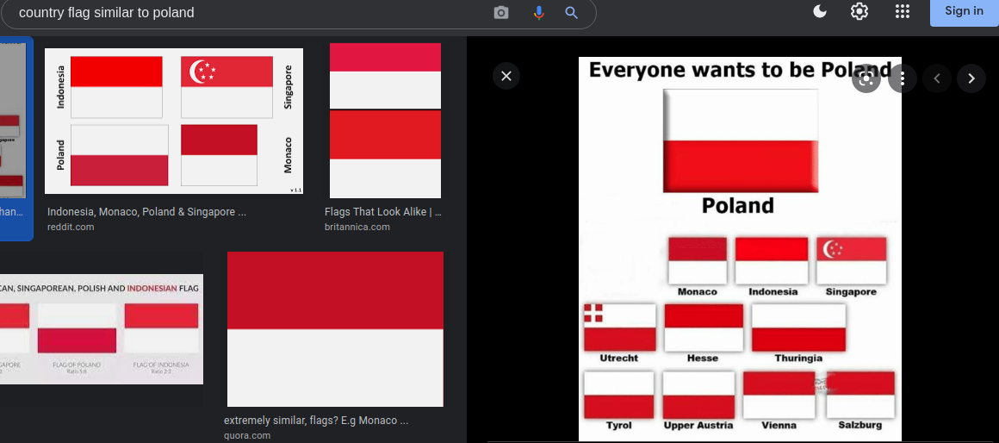
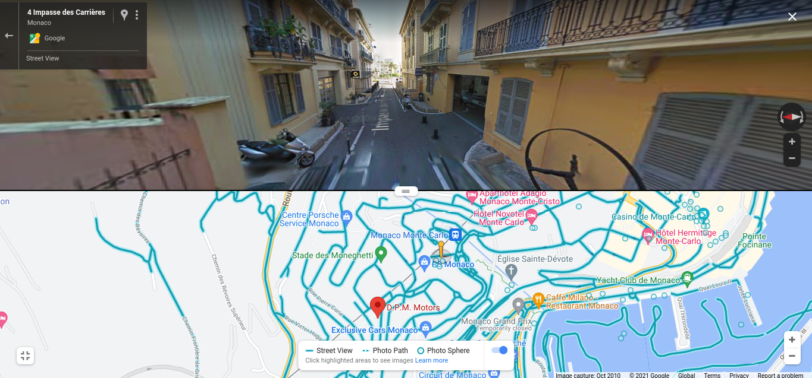

# Geoguessr1 - Misc 

- At first the image will trick you by making you think that this is in Poland 

- But googling flags that are similar to Poland's we find Indonesia and Monaco, Monaco is the place 

- The next that is going to help us is the 2 signs in the back, the `smart` sign doesn't help much, the other sign says `drm` 

- Search that up on google and it will correct you saying that its `dpm motors`, we can confirm by comparing the logos 

- Go to google maps, search dpm motors Monaco and it will take you to the place

- Now from here its really just patience since the image looks to be taken in an alley way, we need to look at static objects that will help us find where this exactly is

- Theres an intersection and a construction building in the background 

- So look around, use street view(this took me quite sometime and eventually i almost gave up)

- After possibly a couple of hours you should be able to find the place in an alley `not too far from dpm motors` 

## Flag - flag{43.738,7.418}