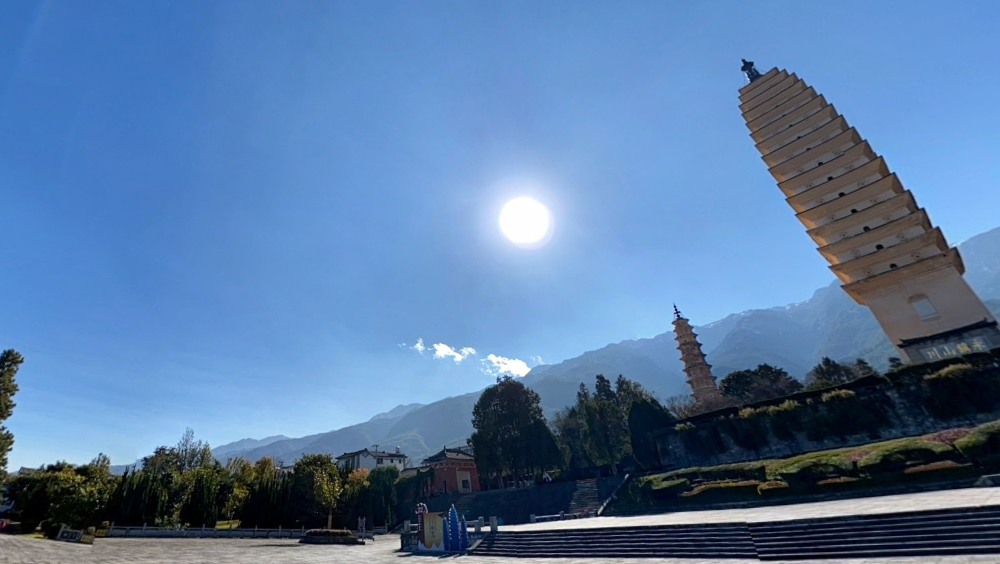
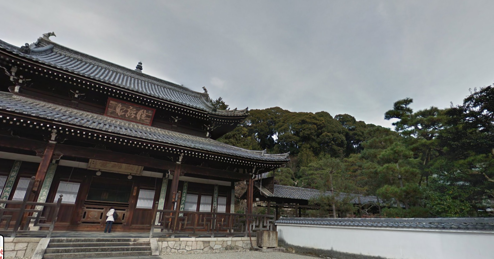
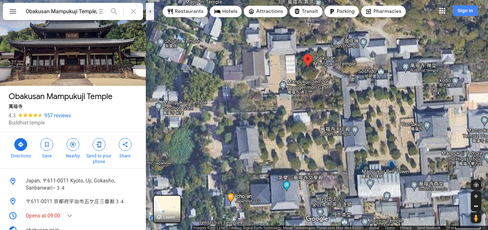

# Geoguessr2 - Misc 

## Location 1 

- There are three pagodas, search that and you will find the place, then `cycle through the 360 view` in google maps to find the exact location

`25.708872,100.1470489`

## Location 2 

- This one was a bit trickier since i wasn't sure if that was japanese or chinese because yandex gave 2 different resolves 

- Reverse image search the image on yandex, look at the results, there should be an image that look just like the one we have along with the location name which is `Obakusan Mampukuji Temple, 三番割-３４ Gokashō, Uji, Kyoto, Japan`

- Search that up, again `cycle through the 360 view` in google maps until you find the exact location

`34.9143,135.8061967`

# Note 

- The lat1 coordinate is 1 off so you're gonna have to guess it

## Flag - flag{25.709,100.147,34.914,135.806}